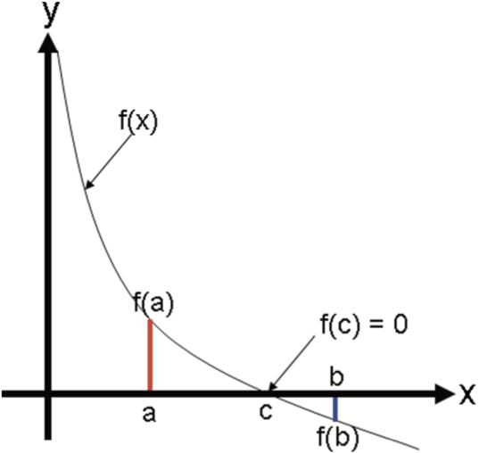

# İkiye Bölme Yöntemi (Bisection Method)

## Teori

İkiye Bölme Yöntemi, sürekli bir fonksiyonun köklerini bulmak için kullanılan sayısal bir yöntemdir. Özellikle analitik olarak çözülmesi zor olan fonksiyonlar için yararlıdır. Yöntem, kökün bulunduğu aralığı yeterince küçük olana kadar daraltarak çalışır.



### Süreç

1. **Başlangıç Aralığı Seçimi**: Fonksiyonun işaret değiştirdiği bir `[a, b]` aralığı ile başlayın (yani, `f(a) * f(b) < 0`). Bu, aralıkta en az bir kök olduğunu gösterir.
2. **Orta Nokta Hesaplama**: Aralığın orta noktasını hesaplayın, `m = (a + b) / 2`.
3. **Kök Kontrolü**: Eğer `f(m) == 0` ise, `m` fonksiyonun bir köküdür.
4. **Aralığı İkiye Bölme**: Eğer `f(m)` sıfır değilse, işaret değişiminin gerçekleştiği alt aralığı belirleyin. Bu, `[a, m]` veya `[m, b]` olacaktır, `f(a) * f(m)` ve `f(b) * f(m)`'in işaretlerine bağlı olarak.
5. **Tekrar Et**: Aralık boyutu önceden belirlenmiş bir tolerans seviyesi, `tol`'dan küçük olana kadar adım 2-4'ü yeni alt aralıkla tekrarlayın.

### Formüller

-   **Orta Nokta**: \( m = \frac{a + b}{2} \)
-   **Fonksiyon Değerlendirmesi**: \( f(m) \)
-   **Aralık Güncellemesi**:
    -   Eğer f(a) . f(m) < 0 ise, yeni aralık `[a, m]` olur.
    -   Eğer f(b) . f(m) < 0 ise, yeni aralık `[m, b]` olur.

## Python Kodu Açıklaması

```python
def bisection_method(f, a, b, tol):
    # Yöntemin uygulanabilir olup olmadığını kontrol eder
    if f(a) * f(b) >= 0:
        print("İkiye bölme yöntemi başarısız oldu.")
        return None

    # Ana döngü: Aralık, toleranstan küçük olana kadar tekrar eder
    while (b - a) / 2.0 > tol:
        orta_nokta = (a + b) / 2.0  # Orta noktayı hesaplar
        if f(orta_nokta) == 0:
            return orta_nokta  # Eğer orta nokta kök ise
        elif f(a) * f(orta_nokta) < 0:  # Yeni aralığı belirler
            b = orta_nokta
        else:
            a = orta_nokta

    return (a + b) / 2.0  # Kökün yaklaşık değerini döndürür

```

#### bisection_method Fonksiyonu

Bu, yarıya bölme yöntemini uygulayan ana fonksiyondur.

#### Parametreler:

-   `f`: Kökü bulunacak fonksiyon.
-   `a`, `b`: Başlangıç aralığı uç noktaları.
-   `tol`: Kök yaklaşımı için tolerans.

#### Aralık Kontrolü

İlk olarak, fonksiyon `f(a)` ve `f(b)`'nin zıt işaretlere sahip olup olmadığını kontrol eder, bu yöntemin çalışması için gereklidir.

#### Döngü

Fonksiyon, aralık boyutu `tol`dan küçük olana kadar bir döngüye girer.

#### Orta Nokta ve Değerlendirme

Her yinelemede, orta nokta hesaplanır ve değerlendirilir. Eğer orta nokta kök ise, döndürülür.

#### Aralık Güncelleme

`f`'nin orta noktadaki işaretine bağlı olarak, aralık ya `[a, midpoint]` ya da `[midpoint, b]` olarak güncellenir.

#### Dönüş

Aralık yeterince küçük olduğunda, fonksiyon orta noktayı yaklaşık kök olarak döndürür.
