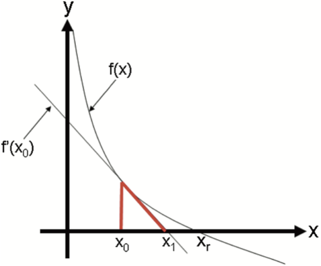

# Newton-Raphson Metodu için Python Fonksiyonu

## Genel Bakış

Bu Python fonksiyonu, gerçek değerli bir fonksiyonun köklerini bulmak için Newton-Raphson metodunu uygular. Newton-Raphson metodu, gerçek değerli bir fonksiyonun köklerini (veya sıfırlarını) bulmak için kullanılan verimli bir algoritmadır.

## Metot Açıklaması

Newton-Raphson metodu, bir fonksiyonun köklerini yaklaşık olarak bulmak için yinelemeli bir yaklaşım kullanır. İlk tahminle başlayarak, belirli bir formül uygulanarak bu tahmini iteratif olarak iyileştirir.

### Görselleştirme

Newton-Raphson metodunu daha iyi anlamak için, genellikle grafiğin gösterilmesi yardımcı olur. Aşağıda, bir fonksiyona uygulanan Newton-Raphson metodunu gösteren bir grafik bulunmaktadır:



### Formül

Newton-Raphson metodunda kullanılan formül:

$$
x_{n+1} = x_n - \frac{f(x_n)}{f'(x_n)}
$$

Burada:

-   \( x_n \) mevcut yaklaşım,
-   \( x\_{n+1} \) bir sonraki yaklaşım,
-   \( f(x) \) kökünü bulmaya çalıştığımız fonksiyon,
-   \( f'(x) \) \( f(x) \) fonksiyonunun türevidir.

## Fonksiyon Kullanımı

### Parametreler

-   `f`: Kökünü bulmaya çalıştığımız fonksiyon.
-   `df`: `f` fonksiyonunun türevi.
-   `x0`: Kök için başlangıç tahmini.
-   `tol`: Kök yaklaşımı için tolerans. Varsayılan değer 1e-6.
-   `max_iter`: Maksimum iterasyon sayısı. Varsayılan değer 1000.

### Dönüş

-   Fonksiyon, `f` fonksiyonunun yaklaşık kökünü döndürür. Belirtilen tolerans veya iterasyon limiti içinde kök bulunamazsa, `None` döndürür.

### Örnek

```python
# Fonksiyonu ve türevini tanımlayın
f = lambda x: 5/x - 2
df = lambda x: -5/x**2

# Başlangıç tahmini
x0 = 3

# Kökü bul
root = newton_raphson_method(f, df, x0)
print("Fonksiyonun yaklaşık kökü:", root)

```
