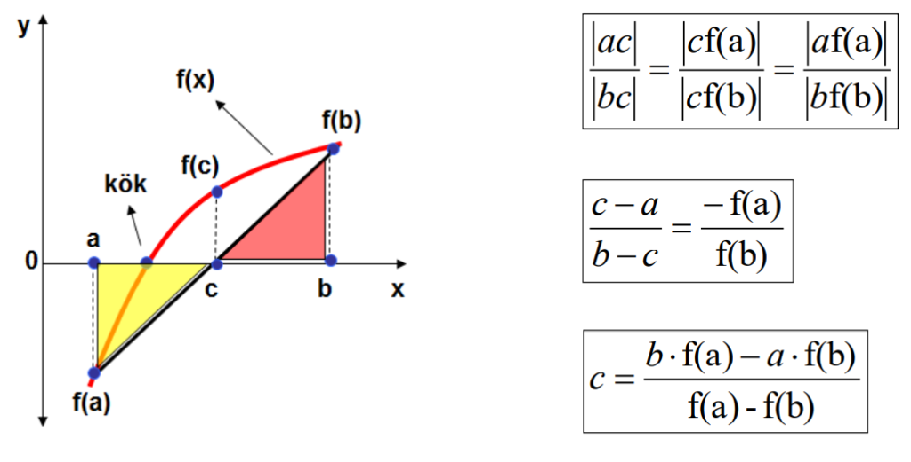

# Doğrusal İnterpolasyon Metodu (Regula Falsi)

## Giriş

Doğrusal İnterpolasyon Metodu, bilinen adıyla Regula Falsi, matematiksel fonksiyonların köklerini bulmak için kullanılan bir yöntemdir. Bu yöntem, iki nokta arasındaki doğru parçası üzerinde iteratif bir yaklaşım yaparak kökü bulmayı amaçlar. Genelde, fonksiyonun işaret değiştirdiği bir aralıkta kullanılır ve bu aralıktaki iki noktayı iteratif olarak güncelleyerek köke yaklaşır.



### Formülü

Doğrusal İnterpolasyon Metodu, aşağıdaki formülle ifade edilir:

$c = b - \frac{f(b) * (b - a)} {f(b) - f(a)}$

Bu formülde, `a` ve `b`, fonksiyonun işaret değiştirdiği aralığın sınırlarını temsil ederken, `c` ise her iterasyonda güncellenen ve köke yaklaşan değerdir.

## Python Fonksiyonu Açıklaması

`false_position_method` fonksiyonu, Doğrusal İnterpolasyon Metodunu uygulamak için yazılmış bir Python fonksiyonudur. Bu fonksiyonun parametreleri ve işleyişi aşağıda açıklanmıştır:

-   `func`: Kökünü bulacağımız fonksiyon.
-   `a`: Aralığın başlangıç noktası.
-   `b`: Aralığın bitiş noktası.
-   `max_iterations`: Yapılacak maksimum iterasyon sayısı. Varsayılan değer 1000'dir.
-   `tolerance`: Kök yaklaşımı için tolerans. Varsayılan değer 1e-6'dır (0.000001).

Fonksiyon, belirtilen iterasyon sayısı boyunca veya belirtilen tolerans değerine ulaşana kadar çalışır. Her iterasyonda, yeni bir `c` değeri hesaplanır ve bu değer, fonksiyonun sıfır olduğu noktaya olan yaklaşımı gösterir. Eğer `f(c)` değeri, belirlenen tolerans değerinden küçükse, `c` kök olarak kabul edilir ve döndürülür. Aksi takdirde, `a` ve `b` değerleri güncellenir. Bu güncelleme, `f(c)` ve `f(a)` işaretlerine göre yapılır; eğer bu iki değer zıt işaretler taşıyorsa, `b` değeri `c` olarak güncellenir, aksi takdirde `a` değeri `c` olarak güncellenir.

Fonksiyon, belirtilen iterasyon sayısına ulaşılana kadar veya yaklaşım belirtilen tolerans değerinden daha iyi bir sonuç verene kadar bu işlemi tekrarlar.

## Örnek Kullanım

Fonksiyonun kullanımına bir örnek aşağıda verilmiştir:

```python
if __name__ == "__main__":
    # Örnek fonksiyon: f(x) = x^3 - 7x^2 + 14x - 6
    func = lambda x: x**3 - (7 * x**2) + (14 * x) - 6

    # Başlangıç noktaları a ve b (f(a) ve f(b)'nin zıt işaretlerde olduğundan emin olun)
    a = 0
    b = 3

    # Kök yaklaşımı için maksimum iterasyon sayısı ve tolerans
    max_iter, tol = 100, 0.001

    # Doğrusal İnterpolasyon Metodu kullanarak kökü bul
    root = false_position_method(func, a, b, max_iter, tol)
    if root is not None:
        print(f"Yaklaşık kök: {root}")
```

Bu örnekte, $x^3 - 7x^2 + 14x - 6$ fonksiyonunun kökü, belirtilen `a`, `b`, iterasyon sayısı ve tolerans değerleri kullanılarak hesaplanır ve ekrana yazdırılır.
